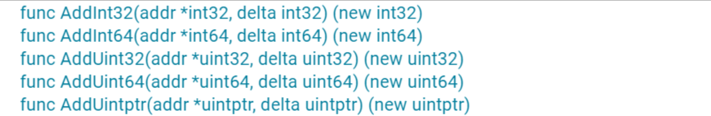
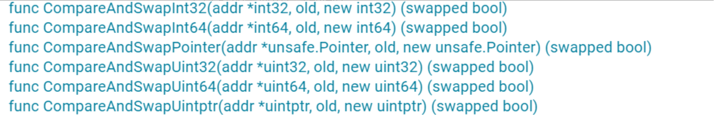
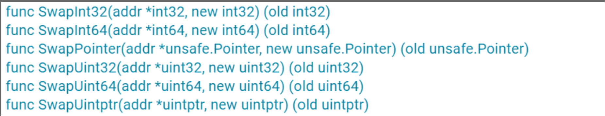
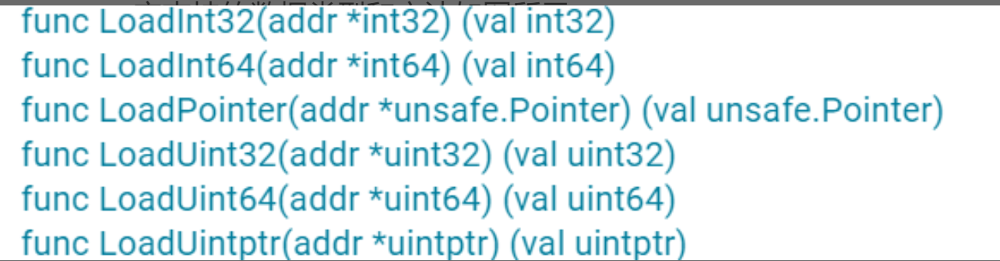
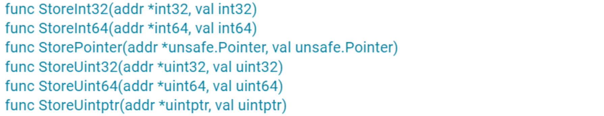
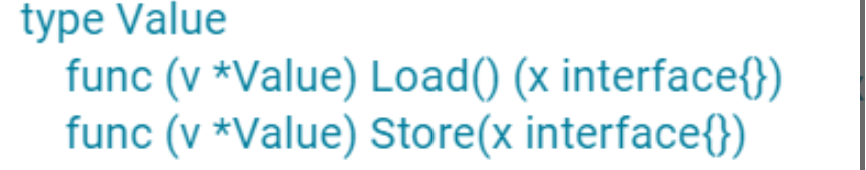

# Atomic 原子操作

Mutex、RWMutex 等并发原语，最底层是通过 atomic 包中的一些原子操作来实现的。

这些并发原语已经可以应对大多数的并发场景了，为啥还要学习原子操作呢？其实，这是因为，在很多场景中，使用并发原语实现起来比较复杂，而原子操作可以帮助我们更轻松地实现底层的优化。

- **CPU 提供了基础的原子操作。**
- **Atomic 原子操作还是实现 lock-free 数据结构的基石。**

对于单处理器单核系统来说，如果一个操作是由一个 CPU 指令来实现的，那么它就是原子操作，比如它的 XCHG 和 INC 等指令。如果操作是基于多条指令来实现的，那么，执行的过程中可能会被中断，并执行上下文切换，这样的话，原子性的保证就被打破了，因为这个时候，操作可能只执行了一半。

## Atomic包提供的方法

关于 atomic，一定要记住，atomic 操作的对象是一个地址，你需要把可寻址的变量的地址作为参数传递给方法，而不是把变量的值传递给方法。

### 1. Add



其实，Add 方法就是给第一个参数地址中的值增加一个 delta 值。

### 2. CAS （CompareAndSwap）

在 CAS 的方法签名中，需要提供要操作的地址、原数据值、新值。

```
func CompareAndSwapInt32(addr *int32, old, new int32) (swapped bool)
```

这个方法会比较当前 addr 地址里的值是不是 old，如果不等于 old，就返回 false；如果等于 old，就把此地址的值替换成 new 值，返回 true。这就相当于“判断相等才替换”。



### 3. Swap

如果不需要比较旧值，只是比较粗暴地替换的话，就可以使用 Swap 方法，它替换后还可以返回旧值。



### 4. Load

Load 方法会取出 addr 地址中的值，即使在多处理器、多核、有 CPU cache 的情况下，这个操作也能保证 Load 是一个原子操作。



### 5. Store

Store 方法会把一个值存入到指定的 addr 地址中，即使在多处理器、多核、有 CPU cache 的情况下，这个操作也能保证 Store 是一个原子操作。别的 goroutine 通过 Load 读取出来，不会看到存取了一半的值。



### 6. Value 类型

刚刚说的都是一些比较常见的类型，其实，atomic 还提供了一个特殊的类型：Value。它可以原子地存取对象类型，但也只能存取，不能 CAS 和 Swap，常常用在配置变更等场景中。



## 实现一个lock free queue

```
package main

import (
	"sync/atomic"
	"unsafe"
)

// LKQueue linked queue, lock-free queue
type LKQueue struct {
	head unsafe.Pointer
	tail unsafe.Pointer
}

type node struct {
	value interface{}
	next  unsafe.Pointer
}

func NewLKQueue() *LKQueue {
	n := unsafe.Pointer(&node{})
	return &LKQueue{head: n, tail: n}
}

func (q *LKQueue) Push(v interface{}) {
	n := &node{value: v}
	for {
		tail := load(&q.tail)
		next := load(&tail.next)
		// 尾还是尾
		if tail == load(&q.tail) {
			// 还没有新数据入队
			if next == nil {
				// 增加到队尾
				if cas(&tail.next, next, n) {
					// 入队成功，移动尾指针
					cas(&q.tail, tail, n)
				}
			} else {
				// 已有新数据加到队列后面，需要移动尾指针
				cas(&q.tail, tail, next)
			}
		}
	}
}

// Pop 出队，没有元素则返回nil
func (q *LKQueue) Pop() interface{} {
	for {
		head := load(&q.head)
		tail := load(&q.tail)
		next := load(&head.next)
		// head还是那个head
		if head == load(&q.head) {
			// head和tail一样
			if head == tail {
				if next == nil { // 说明是空队列
					return nil
				}
				// 只是尾指针还没有调整，尝试调整它指向下一个
				cas(&q.tail, tail, next)
			} else {
				// 读取出队的数据
				v := next.value
				// 既然要出队了，头指针移动到下一个
				if cas(&q.head, head, next) {
					return v
				}
			}
		}
	}
}

// 将unsafe.Pointer原子加载转换成node
func load(p *unsafe.Pointer) *node {
	return (*node)(atomic.LoadPointer(p))
}

func cas(p *unsafe.Pointer, old, new *node) bool {
	return atomic.CompareAndSwapPointer(p, unsafe.Pointer(old), unsafe.Pointer(new))
}
```

这个 lock-free 的实现使用了一个辅助头指针（head），头指针不包含有意义的数据，只是一个辅助的节点，这样的话，出队入队中的节点会更简单。

入队的时候，通过 CAS 操作将一个元素添加到队尾，并且移动尾指针。

出队的时候移除一个节点，并通过 CAS 操作移动 head 指针，同时在必要的时候移动尾指针。
