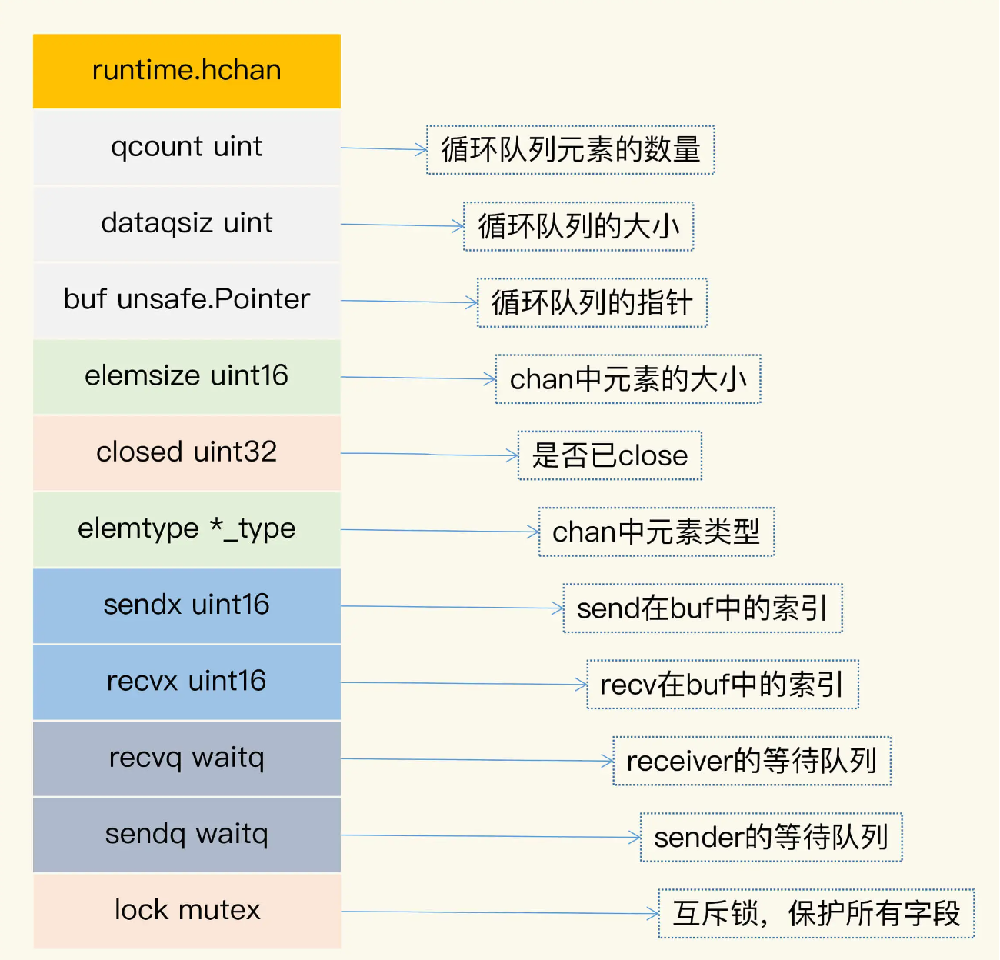

# Channel

1. 数据交流：当作并发的 buffer 或者 queue，解决生产者 - 消费者问题。多个 goroutine 可以并发当作生产者（Producer）和消费者（Consumer）。
2. 数据传递：一个 goroutine 将数据交给另一个 goroutine，相当于把数据的拥有权 (引用) 托付出去。
3. 信号通知：一个 goroutine 可以将信号 (closing、closed、data ready 等) 传递给另一个或者另一组 goroutine 。
4. 任务编排：可以让一组 goroutine 按照一定的顺序并发或者串行的执行，这就是编排的功能。
5. 锁：利用 Channel 也可以实现互斥锁的机制。

## 基本用法

```
chan string       // 可以发送接收string
chan<- struct{}   // 只能发送struct{}
<-chan int        // 只能从chan接收int
```

既能接收又能发送的 chan 叫做双向的 chan，把只能发送和只能接收的 chan 叫做单向的 chan。其中，“<-”表示单向的 chan，如果记不住，有一个简便的方法：这个箭头总是射向左边的，元素类型总在最右边。如果箭头指向 chan，就表示可以往 chan 中塞数据；如果箭头远离 chan，就表示 chan 会往外吐数据。

chan 中的元素是任意的类型，所以也可能是 chan 类型。“<-”有个规则，总是尽量和左边的 chan 结合。

### 初始化

通过 make，我们可以初始化一个 chan，未初始化的 chan 的零值是 nil。你可以设置它的容量，比如下面的 chan 的容量是 9527，我们把这样的 chan 叫做 buffered chan；如果没有设置，它的容量是 0，我们把这样的 chan 叫做 unbuffered chan。

```
make(chan int,9527)
```

如果 chan 中还有数据，那么，从这个 chan 接收数据的时候就不会阻塞，如果 chan 还未满（“满”指达到其容量），给它发送数据也不会阻塞，否则就会阻塞。unbuffered chan 只有读写都准备好之后才不会阻塞，这也是很多使用 unbuffered chan 时的常见 Bug。

还有一点需要记住：nil 是 chan 的零值，是一种特殊的 chan，对值是 nil 的 chan 的发送接收调用者总是会阻塞。

### 发送数据

往 chan 中发送一个数据使用“ch<-”，发送数据是一条语句:

```
ch <- 2000
```

### 接收数据

从 chan 中接收一条数据使用“<-ch”，接收数据也是一条语句：

```
x := <-chan  // 把接收的一条数据赋值给变量x
foo(<-ch)    // 把接收的一个的数据作为参数传给函数
<-ch         // 丢弃接收的一条数据
```

接收数据时，还可以返回两个值。第一个值是返回的 chan 中的元素，很多人不太熟悉的是第二个值。第二个值是 bool 类型，代表是否成功地从 chan 中读取到一个值，如果第二个参数是 false，chan 已经被 close 而且 chan 中没有缓存的数据，这个时候，第一个值是零值。所以，如果从 chan 读取到一个零值，可能是 sender 真正发送的零值，也可能是 closed 的并且没有缓存元素产生的零值。

### 其他操作

Go 内建的函数 close、cap、len 都可以操作 chan 类型：close 会把 chan 关闭掉，cap 返回 chan 的容量，len 返回 chan 中缓存的还未被取走的元素数量。

## Channel的实现原理

### 1. Chan数据结构

[https://github.com/golang/go/blob/master/src/runtime/chan.go#L32](https://github.com/golang/go/blob/master/src/runtime/chan.go#L32)



- qcount：代表 chan 中已经接收但还没被取走的元素的个数。内建函数 len 可以返回这个字段的值。
- dataqsiz：队列的大小。chan 使用一个循环队列来存放元素，循环队列很适合这种生产者 - 消费者的场景（我很好奇为什么这个字段省略 size 中的 e）。
- buf：存放元素的循环队列的 buffer。
- elemtype 和 elemsize：chan 中元素的类型和 size。因为 chan 一旦声明，它的元素类型是固定的，即普通类型或者指针类型，所以元素大小也是固定的。
- sendx：处理发送数据的指针在 buf 中的位置。一旦接收了新的数据，指针就会加上 elemsize，移向下一个位置。buf 的总大小是 elemsize 的整数倍，而且 buf 是一个循环列表。
- recvx：处理接收请求时的指针在 buf 中的位置。一旦取出数据，此指针会移动到下一个位置。
- recvq：chan 是多生产者多消费者的模式，如果消费者因为没有数据可读而被阻塞了，就会被加入到 recvq 队列中。
- sendq：如果生产者因为 buf 满了而阻塞，会被加入到 sendq 队列中。

## 会panic的情况

总共有3种：

1. close 为 nil 的 chan；
2. send 已经 close 的 chan；
3. close 已经 close 的 chan。

## Best Practice

1. 共享资源的并发访问使用传统并发原语；
2. 复杂的任务编排和消息传递使用 Channel；
3. 消息通知机制使用 Channel，除非只想 signal 一个 goroutine，才使用 Cond；
4. 简单等待所有任务的完成用 WaitGroup，也有 Channel 的推崇者用 Channel，都可以；
5. 需要和 Select 语句结合，使用 Channel；
6. 需要和超时配合时，使用 Channel 和 Context。
