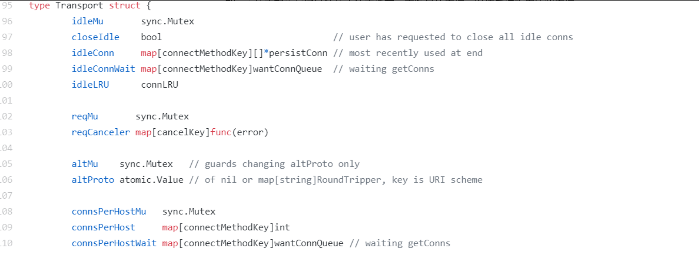

# Pool

性能提升大杀器。

做性能优化的时候，会采用对象池的方式，把不用的对象回收起来，避免被垃圾回收掉，这样使用的时候就不必在堆上重新创建了。

不止如此，像数据库连接、TCP 的长连接，这些连接在创建的时候是一个非常耗时的操作。如果每次都创建一个新的连接对象，耗时较长，很可能整个业务的大部分耗时都花在了创建连接上。

所以，如果我们能把这些连接保存下来，避免每次使用的时候都重新创建，不仅可以大大减少业务的耗时，还能提高应用程序的整体性能。

Go 标准库中提供了一个通用的 Pool 数据结构，也就是 sync.Pool，我们使用它可以创建池化的对象。

除此之外，我还会专门介绍一个池的应用场景： Worker Pool，或者叫做 goroutine pool，这也是常用的一种并发模式，可以使用有限的 goroutine 资源去处理大量的业务数据。

## sync.Pool

sync.Pool 数据类型用来保存一组可独立访问的临时对象。请注意这里加粗的“临时”这两个字，它说明了 sync.Pool 这个数据类型的特点，也就是说，它池化的对象会在未来的某个时候被毫无预兆地移除掉。而且，如果没有别的对象引用这个被移除的对象的话，这个被移除的对象就会被垃圾回收掉。

因为 Pool 可以有效地减少新对象的申请，从而提高程序性能，所以 Go 内部库也用到了 sync.Pool，比如 fmt 包，它会使用一个动态大小的 buffer 池做输出缓存，当大量的 goroutine 并发输出的时候，就会创建比较多的 buffer，并且在不需要的时候回收掉。

有两个知识点你需要记住：

- sync.Pool 本身就是线程安全的，多个 goroutine 可以并发地调用它的方法存取对象；
- sync.Pool 不可在使用之后再复制使用。

## sync.Pool 的使用方法

它只提供了三个对外的方法：New、Get 和 Put。

### 1. New

Pool struct 包含一个 New 字段，这个字段的类型是函数 func() interface{}。当调用 Pool 的 Get 方法从池中获取元素，没有更多的空闲元素可返回时，就会调用这个 New 方法来创建新的元素。如果你没有设置 New 字段，没有更多的空闲元素可返回时，Get 方法将返回 nil，表明当前没有可用的元素。

### 2. Get

如果调用这个方法，就会从 Pool取走一个元素，这也就意味着，这个元素会从 Pool 中移除，返回给调用者。不过，除了返回值是正常实例化的元素，Get 方法的返回值还可能会是一个 nil（Pool.New 字段没有设置，又没有空闲元素可以返回），所以你在使用的时候，可能需要判断。

### 3. Put

这个方法用于将一个元素返还给 Pool，Pool 会把这个元素保存到池中，并且可以复用。但如果 Put 一个 nil 值，Pool 就会忽略这个值。

## 常见场景：buffer池（缓冲池）

因为 byte slice 是经常被创建销毁的一类对象，使用 buffer 池可以缓存已经创建的 byte slice，比如，著名的静态网站生成工具 Hugo 中，就包含这样的实现。

```
var buffers = sync.Pool{
  New: func() interface{} { 
    return new(bytes.Buffer)
  },
}

func GetBuffer() *bytes.Buffer {
  return buffers.Get().(*bytes.Buffer)
}

func PutBuffer(buf *bytes.Buffer) {
  buf.Reset()
  buffers.Put(buf)
}
```

这段代码很常见，但是是有问题的：内存泄露。

取出来的 bytes.Buffer 在使用的时候，我们可以往这个元素中增加大量的 byte 数据，这会导致底层的 byte slice 的容量可能会变得很大。这个时候，即使 Reset 再放回到池子中，这些 byte slice 的容量不会改变，所占的空间依然很大。而且，因为 Pool 回收的机制，这些大的 Buffer 可能不被回收，而是会一直占用很大的空间，这属于内存泄漏的问题。

即使是 Go 的标准库，在内存泄漏这个问题上也栽了几次坑。再比如 encoding、json 中类似的问题：将容量已经变得很大的 Buffer 再放回 Pool 中，导致内存泄漏。后来在元素放回时，增加了检查逻辑，改成放回的超过一定大小的 buffer，就直接丢弃掉，不再放到池子中。

在使用 sync.Pool 回收 buffer 的时候，一定要检查回收的对象的大小。如果 buffer 太大，就不要回收了，否则就太浪费了。

### 内存浪费

除了内存泄漏以外，还有一种浪费的情况，就是池子中的 buffer 都比较大，但在实际使用的时候，很多时候只需要一个小的 buffer，这也是一种浪费现象。接下来，我就讲解一下这种情况的处理方法。

要做到物尽其用，尽可能不浪费的话，我们可以将 buffer 池分成几层。首先，小于 512 byte 的元素的 buffer 占一个池子；其次，小于 1K byte 大小的元素占一个池子；再次，小于 4K byte 大小的元素占一个池子。这样分成几个池子以后，就可以根据需要，到所需大小的池子中获取 buffer 了。

## 连接池

Pool 的另一个很常用的一个场景就是保持 TCP 的连接。一个 TCP 的连接创建，需要三次握手等过程，如果是 TLS 的，还会需要更多的步骤，如果加上身份认证等逻辑的话，耗时会更长。所以，为了避免每次通讯的时候都新创建连接，我们一般会建立一个连接的池子，预先把连接创建好，或者是逐步把连接放在池子中，减少连接创建的耗时，从而提高系统的性能。

事实上，我们很少会使用 sync.Pool 去池化连接对象，原因就在于，sync.Pool 会无通知地在某个时候就把连接移除垃圾回收掉了，而我们的场景是需要长久保持这个连接，所以，我们一般会使用其它方法来池化连接，比如接下来我要讲到的几种需要保持长连接的 Pool。

### 标准库中的 http client 池

标准库的 http.Client 是一个 http client 的库，可以用它来访问 web 服务器。为了提高性能，这个 Client 的实现也是通过池的方法来缓存一定数量的连接，以便后续重用这些连接。

http.Client 实现连接池的代码是在 Transport 类型中，它使用 idleConn 保存持久化的可重用的长连接：



### TCP连接池

最常用的一个 TCP 连接池是 fatih 开发的 [https://github.com/fatih/pool](https://github.com/fatih/pool), 虽然这个项目已经被 fatih 归档（Archived），不再维护了，但是因为它相当稳定了，我们可以开箱即用。即使你有一些特殊的需求，也可以 fork 它，然后自己再做修改。

它的使用套路如下：

```
// 工厂模式，提供创建连接的工厂方法
factory    := func() (net.Conn, error) { return net.Dial("tcp", "127.0.0.1:4000") }

// 创建一个tcp池，提供初始容量和最大容量以及工厂方法
p, err := pool.NewChannelPool(5, 30, factory)

// 获取一个连接
conn, err := p.Get()

// Close并不会真正关闭这个连接，而是把它放回池子，所以你不必显式地Put这个对象到池子中
conn.Close()

// 通过调用MarkUnusable, Close的时候就会真正关闭底层的tcp的连接了
if pc, ok := conn.(*pool.PoolConn); ok {
  pc.MarkUnusable()
  pc.Close()
}

// 关闭池子就会关闭=池子中的所有的tcp连接
p.Close()

// 当前池子中的连接的数量
current := p.Len()
```

虽然我一直在说 TCP，但是它管理的是更通用的 net.Conn，不局限于 TCP 连接。

它通过把 net.Conn 包装成 PoolConn，实现了拦截 net.Conn 的 Close 方法，避免了真正地关闭底层连接，而是把这个连接放回到池中：

```
  type PoolConn struct {
    net.Conn
    mu       sync.RWMutex
    c        *channelPool
    unusable bool
  }
  
  //拦截Close
  func (p *PoolConn) Close() error {
    p.mu.RLock()
    defer p.mu.RUnlock()
  
    if p.unusable {
      if p.Conn != nil {
        return p.Conn.Close()
      }
      return nil
    }
    return p.c.put(p.Conn)
  }
```

它的 Pool 是通过 Channel 实现的，空闲的连接放入到 Channel 中，这也是 Channel 的一个应用场景：

```
  type channelPool struct {
    // 存储连接池的channel
    mu    sync.RWMutex
    conns chan net.Conn
  

    // net.Conn 的产生器
    factory Factory
  }
```

## Worker Pool

goroutine 是一个很轻量级的“纤程”，在一个服务器上可以创建十几万甚至几十万的 goroutine。但是“可以”和“合适”之间还是有区别的，你会在应用中让几十万的 goroutine 一直跑吗？基本上是不会的。

一个 goroutine 初始的栈大小是 2048 个字节，并且在需要的时候可以扩展到 1GB。所以，大量的 goroutine 还是很耗资源的。同时，大量的 goroutine 对于调度和垃圾回收的耗时还是会有影响的，因此，goroutine 并不是越多越好。

有的时候，我们就会创建一个 Worker Pool 来减少 goroutine 的使用。比如，我们实现一个 TCP 服务器，如果每一个连接都要由一个独立的 goroutine 去处理的话，在大量连接的情况下，就会创建大量的 goroutine，这个时候，我们就可以创建一个固定数量的 goroutine（Worker），由这一组 Worker 去处理连接，比如fasthttp的[worker pool](https://github.com/valyala/fasthttp/blob/9f11af296864153ee45341d3f2fe0f5178fd6210/workerpool.go#L16)。

Worker 的实现也是五花八门的：

- 有些是在后台默默执行的，不需要等待返回结果；
- 有些需要等待一批任务执行完；
- 有些 Worker Pool 的生命周期和程序一样长；
- 有些只是临时使用，执行完毕后，Pool 就销毁了。

大部分的 Worker Pool 都是通过 Channel 来缓存任务的，因为 Channel 能够比较方便地实现并发的保护，有的是多个 Worker 共享同一个任务 Channel，有些是每个 Worker 都有一个独立的 Channel。

Worker pool推荐：

- [https://github.com/alitto/pond](https://github.com/alitto/pond)
- [https://pkg.go.dev/github.com/gammazero/workerpool](https://pkg.go.dev/github.com/gammazero/workerpool)
- [https://pkg.go.dev/github.com/ivpusic/grpool](https://pkg.go.dev/github.com/ivpusic/grpool)
- [https://pkg.go.dev/github.com/dpaks/goworkers](https://pkg.go.dev/github.com/dpaks/goworkers)